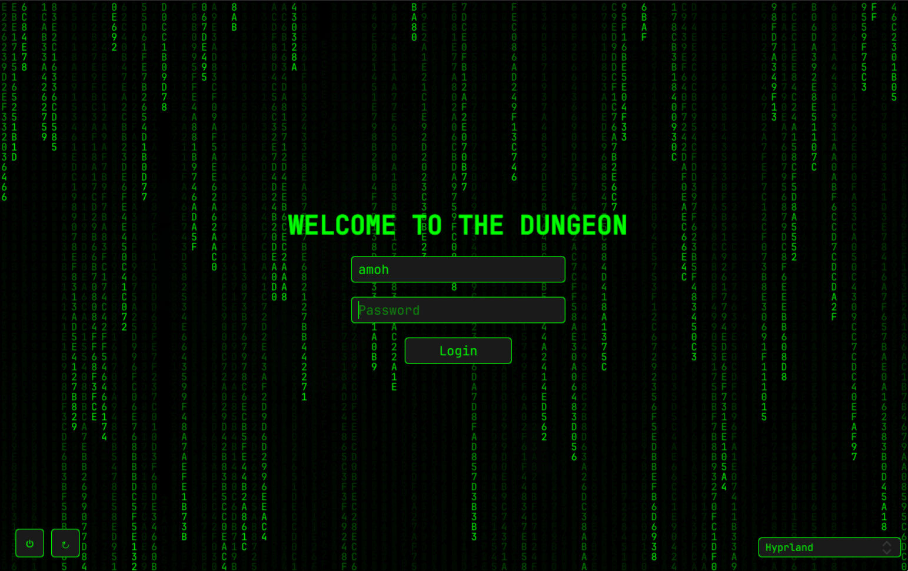

# SDDM Hacker Theme
This is a hacker-style SDDM theme with a dark background, neon green text, and a matrix digital rain effect.

## 



## Installation :

```bash
bash <(curl -sL https://raw.githubusercontent.com/Qaddoumi/sddm-hacker-theme/main/install.sh)
```

## Notes
- The matrix effect is lightweight but can be disabled by removing the `Canvas` and `Timer` components in `Main.qml` if performance is an issue.
- Ensure you have the necessary Qt6 dependencies (requires `qt6-declarative`) installed for QML rendering.
- For a more simple setup (no video), you can replace `Main.qml` with `Main.qml.imageNoVideo` and make sure it name is `Main.qml`